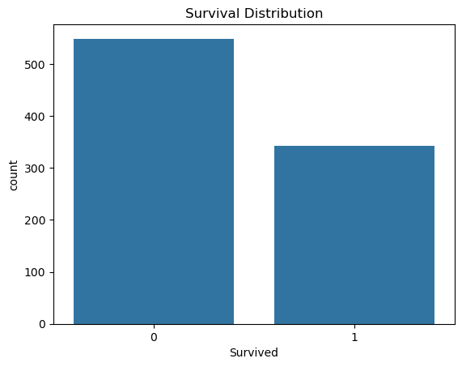

# 🚢 Titanic Survival Prediction -- Machine Learning Project

---

## 📸 Project Screenshot

A complete end-to-end Machine Learning project that predicts whether a
passenger survived the Titanic disaster using multiple classification
models and a deployed Streamlit web app.

---

## 📌 Project Overview

This project involves: - Data preprocessing and feature engineering -
Training multiple ML models - Hyperparameter tuning using GridSearchCV -
Model evaluation and selection - Deployment using Streamlit

---

## 🧠 Problem Statement

Predict whether a passenger survived the Titanic disaster based on
features like: - Passenger class - Age - Sex - Fare - Family size -
Title - Age groups - Fare bins

---

## ⚙️ Tech Stack

- Python 🐍
- Pandas, NumPy
- Scikit-learn 🤖
- Streamlit 🌐
- Pickle (Model serialization)

---

## 📊 Features Used

Final engineered features:

- Pclass
- Sex
- Age
- Fare
- FamilySize
- IsAlone
- Title
- AgeGroup
- FareBin

---

## 🤖 Machine Learning Models Used

- Gaussian Naive Bayes
- Logistic Regression
- Random Forest Classifier

---

## 🔍 Model Selection

- Models were evaluated using:
  - Accuracy
  - Precision
  - Recall
  - F1 Score
- Hyperparameter tuning performed using GridSearchCV
- Best model selected based on F1 Score on test data

---

## 🚀 Best Model

The final selected model is saved as: final_model.sav

It is used in the Streamlit application for real-time predictions.

---

## 📦 Project Structure

titanic-ml-project/
│
├── app.py # Streamlit web app
├── requirements.txt # Dependencies
├── titanic_notebook.ipynb
├── README.md
│
├── src/
│ ├── best_model.py
│ ├── clean_data.py
│ ├── gaussian.py
│ ├── hyperparameter_tuning.py
│ ├── logisticRegression.py
│ ├── pipe.py
│ ├── randomForest.py
│ ├── trainModels.py
│ ├── pipe.py # Pipeline
│
├── model/
│ ├── final_model.sav # Trained ML model
│
├── data/
│ ├── clean_titanic.csv
│ ├── titanic.csv
│

---

## 🌐 How to Run Locally

1.  Clone repo
2.  Install requirements: pip install -r requirements.txt
3.  Run: streamlit run app.py

---

## 📈 Streamlit App Features

- Interactive input form
- Real-time prediction
- Probability output
- Clean UI

---

## 📌 Key Learnings

- Feature engineering improves performance
- Pipelines prevent data leakage
- GridSearchCV optimizes hyperparameters
- Streamlit enables fast deployment

---

## 🚀 Future Improvements

- SHAP explainability
- Better feature automation

---

## 👨‍💻 Author

Vishal Salyan

## ⭐ If you like this project

Give it a ⭐ on GitHub and feel free to contribute!
